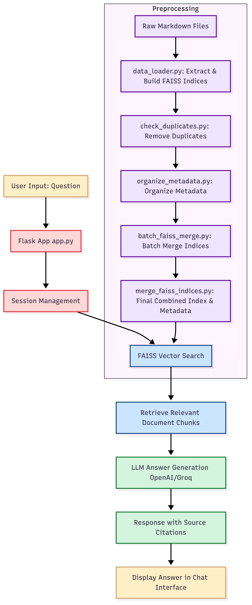

# JFK QA Chatbot

## Overview
The JFK QA Chatbot is a Flask-based web application designed to answer user questions using declassified government documents. It is designed to help researchers, journalists, and curious individuals explore these files quickly, without having to read through thousands of pages. The chatbot leverages a FAISS vector database for efficient document retrieval and integrates with large language models (LLMs) like OpenAI's GPT or Groq's Llama for generating answers. It provides accurate, context-based responses while citing relevant sources.

---

## Features
- **Interactive Chat Interface**: Users can ask questions and receive detailed answers with source citations.
- **FAISS Vector Database**: Efficient retrieval of relevant document chunks.
- **LLM Integration**: Supports OpenAI's GPT and Groq's Llama for generating answers.
- **Session Management**: Maintains chat history for each user session.
- **Preprocessing Tools**: Scripts to preprocess and organize data, build FAISS indices, and manage metadata.

---

## Project Structure

### Main Application Files
1. **`app.py`**
   - Flask application entry point.
   - Handles routes for the chat interface and session management.

2. **`jfk_qa_chatbot.py`**
   - Core logic for embedding, FAISS search, and LLM-based answer generation.
   - Configurable options for LLM provider and answer generation.

3. **`llm_handlers.py`**
   - Functions to interact with OpenAI and Groq APIs for LLM-based answers.

4. **`templates/index.html`**
   - HTML template for the chat interface.

5. **`static/css/styles.css`**
   - Styling for the chat interface.

6. **Data Files**
   - **`Combined_FAISS/combined_index.bin`**: FAISS index file for document retrieval.
   - **`Combined_FAISS/combined_metadata.pkl`**: Metadata file for document chunks.

### Preprocessing Scripts
1. **`data_loader.py`**
   - Processes markdown files, extracts text, and builds FAISS indices with metadata.

2. **`check_duplicates.py`**
   - Identifies duplicate index and metadata files.

3. **`organize_metadata.py`**
   - Organizes metadata files into subdirectories based on file extensions.

4. **`batch_faiss_merge.py`**
   - Merges multiple FAISS indices and metadata files into a single combined index and metadata.

5. **`merge_faiss_indices.py`**
   - Combines individual FAISS indices and metadata into a unified dataset.

---

## Installation

### Prerequisites
- Python 3.8+
- Virtual environment (recommended)
- Required Python packages (see `requirements.txt`)

### Steps
1. Clone the repository:
   ```bash
   git clone <repository-url>
   cd JFK_QA_Chatbot
   ```

2. Create and activate a virtual environment:
   ```bash
   python -m venv venv
   source venv/bin/activate  # On Windows: venv\Scripts\activate
   ```

3. Install dependencies:
   ```bash
   pip install -r requirements.txt
   ```

4. Download required data files:
   - The FAISS index and metadata files are too large to store in the repository. Download them from the provided Google Drive links in `Combined_FAISS/Download_Data.txt`.
   - Place the downloaded files (`combined_index.bin` and `combined_metadata.pkl`) in the `Combined_FAISS` folder.

5. Set up environment variables:
   - Create a `.env` file in the root directory.
   - Add the following variables:
     ```env
     OPENAI_API_KEY=<your-openai-api-key>
     GROQ_API_KEY=<your-groq-api-key>
     ```

6. Run the application:
   ```bash
   python app.py
   ```

7. Access the application at `http://127.0.0.1:5000`.

---

## Usage
1. Open the application in your browser.
2. Type a question in the chat box and submit.
3. View the answer along with source citations.
4. Use the "Clear Chat History" button to reset the session.

---

## Preprocessing Workflow

### Overview
The preprocessing scripts are used to prepare the FAISS index and metadata from raw markdown files. This involves:
1. Extracting text and metadata from markdown files.
2. Organizing metadata files.
3. Chunking text for FAISS indexing.
4. Building individual FAISS indices and metadata.
5. Merging indices and metadata into a combined dataset.

### Steps
1. **Process Markdown Files**:
   Use `data_loader.py` to extract text, chunk it, and build FAISS indices.
   ```bash
   python Preprocessing/data_loader.py
   ```

2. **Check Duplicates**:
   Verify and remove duplicate files using `check_duplicates.py`.
   ```bash
   python Preprocessing/check_duplicates.py
   ```

3. **Organize Metadata**:
   Run `organize_metadata.py` to sort metadata files into subdirectories.
   ```bash
   python Preprocessing/organize_metadata.py
   ```

4. **Batch Processing**:
   For large datasets, use `batch_faiss_merge.py` to process indices in batches.
   ```bash
   python Preprocessing/batch_faiss_merge.py
   ```

5. **Merge Indices**:
   Combine individual indices and metadata using `merge_faiss_indices.py`.
   ```bash
   python Preprocessing/merge_faiss_indices.py
   ```

---

## Configuration

### Application Settings
- **`USE_LLM_ANSWER`**: Toggle between raw chunk display and LLM-generated answers.
- **`LLM_PROVIDER`**: Choose between "openai" and "groq".

### Preprocessing Settings
- **Chunk Size**: Adjust the `chunk_size` parameter in `data_loader.py`.
- **Batch Size**: Modify `BATCH_SIZE` in `batch_faiss_merge.py` for memory optimization
  
---

---

## Future Improvements
- Add support for additional LLM providers.
- Enhance preprocessing scripts for scalability.
- Improve UI/UX of the chat interface.

---

## License
This project is licensed under the MIT License. See the `LICENSE` file for details.

---

## Acknowledgments
- OpenAI for GPT models.
- Groq for Llama models.
- FAISS for efficient vector search.
- Flask for the web framework.
- OCR data provided by [noops888](https://github.com/noops888/jfk-files-text), which was used to build the FAISS index and chatbot content. I also experimented with Azure Vision OCR on the original documents, but the processed data from noops888 was already complete and available.
- Original JFK documents were collected from the [U.S. National Archives](https://www.archives.gov/research/jfk).
